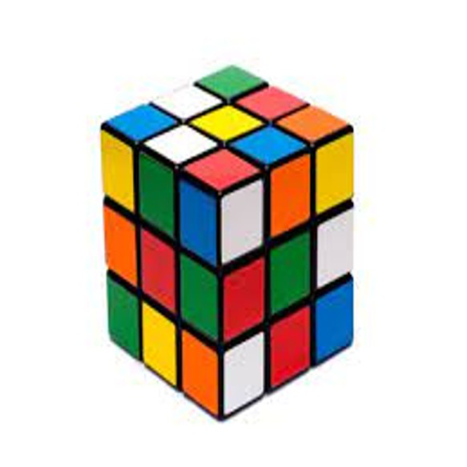
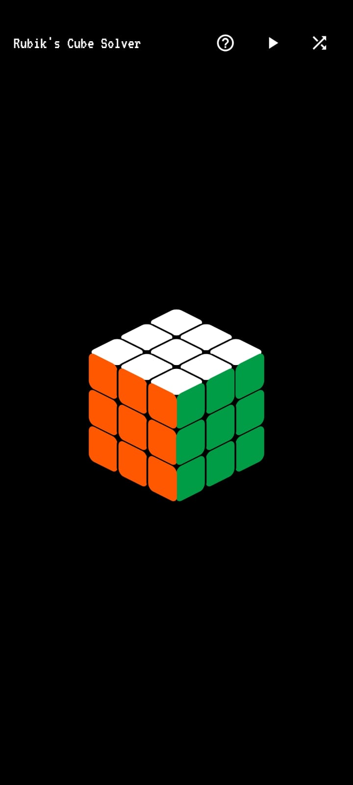
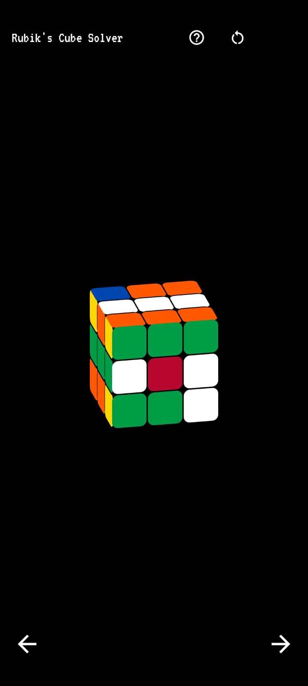
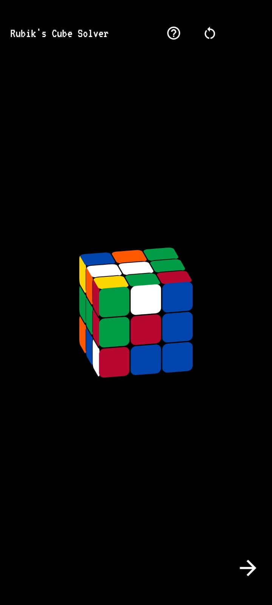
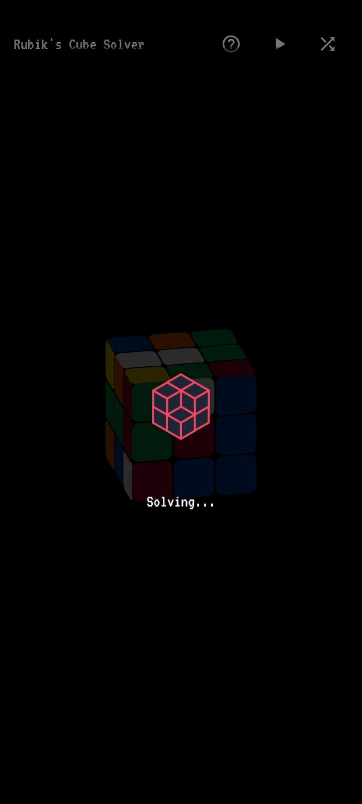
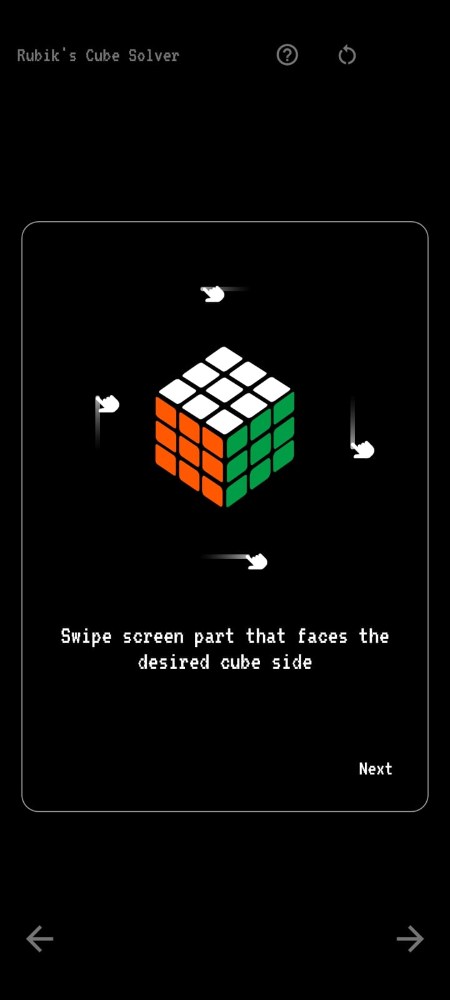
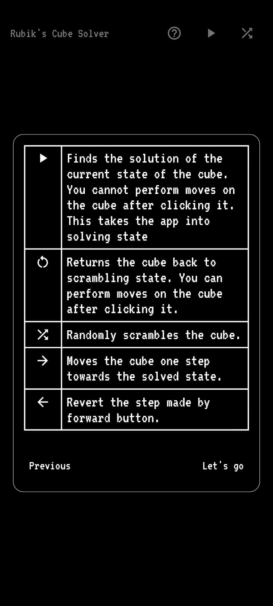

<!-- Improved compatibility of back to top link: See: https://github.com/othneildrew/Best-README-Template/pull/73 -->

<!--
*** Thanks for checking out the Best-README-Template. If you have a suggestion
*** that would make this better, please fork the repo and create a pull request
*** or simply open an issue with the tag "enhancement".
*** Don't forget to give the project a star!
*** Thanks again! Now go create something AMAZING! :D
-->

<!-- PROJECT SHIELDS -->
<!--
*** I'm using markdown "reference style" links for readability.
*** Reference links are enclosed in brackets [ ] instead of parentheses ( ).
*** See the bottom of this document for the declaration of the reference variables
*** for contributors-url, forks-url, etc. This is an optional, concise syntax you may use.
*** https://www.markdownguide.org/basic-syntax/#reference-style-links
-->
[![Contributors][contributors-shield]][contributors-url]
[![Forks][forks-shield]][forks-url]
[![Stargazers][stars-shield]][stars-url]
[![Issues][issues-shield]][issues-url]
[![LinkedIn][linkedin-shield]][linkedin-url]

<!-- PROJECT LOGO -->
 

  

  <h3 align="center">Rubik's Cube Solver</h3>

<!-- TABLE OF CONTENTS -->

  
Table of Contents

  <ol>
    <li>
      <a href="#about-the-project">About The Project</a>
      <ul>
        <li><a href="#built-with">Built With</a></li>
      </ul>
    </li>
    <li><a href="#usage">Usage</a></li>
    <li><a href="#roadmap">Roadmap</a></li>
    <li><a href="#contributing">Contributing</a></li>
    <li><a href="#contact">Contact</a></li>
    <li><a href="#acknowledgments">Acknowledgments</a></li>
  </ol>

<!-- ABOUT THE PROJECT -->
## About The Project

  
  
  
  
  
  
  

The aim of this project is to provide a user-friendly interface for people to scramble a 3x3 rubik's cube and get a solution to it
within seconds. The motivation is to bring the beauty of rubik's cube game to everyone.

(<a href="#readme-top">back to top</a>)

### Built With

The whole app is built using the following

* 
* 
* 
* 

(<a href="#readme-top">back to top</a>)

<!-- USAGE EXAMPLES -->
## Usage

To Use this you can directly download the APK or use the web app. The links for all of them is provided here :
https://adittya-gupta.github.io/rubikLinkTree/

(<a href="#readme-top">back to top</a>)

## Mathematics behind the Solver

To understand about the alogrithm and the mathematics behind the solver you can refer to the pdf provided in the repo. It is basically my
translation of the mathematics behind the solver which is given in Koceimbas's own website

<!-- ROADMAP -->
## Roadmap

- [x] Publish First Version
- [x] Add Readme
- [ ] Add scanner support which can scan any rubik's cube, then using computer vision convert it into the form solvable by the current solver
- [ ] Making the UI a little more smoother
- [ ] Make the solver solve the rubik's cube by implementing the solver in Dart

(<a href="#readme-top">back to top</a>)

<!-- CONTRIBUTING -->
## Contributing

Contributions are what make the open source community such an amazing place to learn, inspire, and create. Any contributions you make are **greatly appreciated**.

If you have a suggestion that would make this better, please fork the repo and create a pull request. You can also simply open an issue with the tag "enhancement".
Don't forget to give the project a star! Thanks again!

1. Fork the Project
2. Create your Feature Branch (`git checkout -b feature/AmazingFeature`)
3. Commit your Changes (`git commit -m 'Add some AmazingFeature'`)
4. Push to the Branch (`git push origin feature/AmazingFeature`)
5. Open a Pull Request

(<a href="#readme-top">back to top</a>)

<!-- CONTACT -->
## Contact

Adittya Gupta - adittya175@gmail.com

Project Link: [https://github.com/Adittya-Gupta/Rubik-s-Cube-Solver.git]

(<a href="#readme-top">back to top</a>)

<!-- ACKNOWLEDGMENTS -->
## Acknowledgments

I would like to extend my greatest thanks to these places which I referenced during the building of this project

* [Herbert Koceimba Official Website](http://kociemba.org/cube.htm)
* [Z Flutter Library](https://pub.dev/packages/zflutter)
* [Lottie Animation](https://lottiefiles.com/)
* [Img Shields](https://shields.io)
* [GitHub Pages](https://pages.github.com)
* [Font Awesome](https://fontawesome.com)

(<a href="#readme-top">back to top</a>)

<!-- MARKDOWN LINKS & IMAGES -->
<!-- https://www.markdownguide.org/basic-syntax/#reference-style-links -->
[contributors-shield]: https://img.shields.io/github/contributors/Adittya-Gupta/Rubik-s-Cube-Solver.svg?style=for-the-badge
[contributors-url]: https://github.com/Adittya-Gupta/Rubik-s-Cube-Solver/graphs/contributors
[forks-shield]: https://img.shields.io/github/forks/Adittya-Gupta/Rubik-s-Cube-Solver.svg?style=for-the-badge
[forks-url]: https://github.com/Adittya-Gupta/Rubik-s-Cube-Solver/network/members
[stars-shield]: https://img.shields.io/github/stars/Adittya-Gupta/Rubik-s-Cube-Solver.svg?style=for-the-badge
[stars-url]: https://github.com/Adittya-Gupta/Rubik-s-Cube-Solver/stargazers
[issues-shield]: https://img.shields.io/github/issues/Adittya-Gupta/Rubik-s-Cube-Solver.svg?style=for-the-badge
[issues-url]: https://github.com/Adittya-Gupta/Rubik-s-Cube-Solver/issues
[linkedin-shield]: https://img.shields.io/badge/-LinkedIn-black.svg?style=for-the-badge&logo=linkedin&colorB=555
[linkedin-url]: https://www.linkedin.com/in/adittya-gupta-b64356224/
[product-screenshot1]: images/screenshot1.jpeg
[product-screenshot2]: images/screenshot2.jpeg
[product-screenshot3]: images/screenshot3.jpeg
[product-screenshot4]: images/screenshot4.jpeg
[product-screenshot5]: images/screenshot5.jpeg

